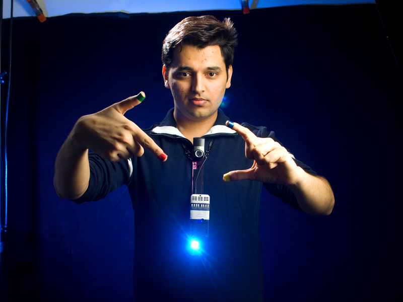
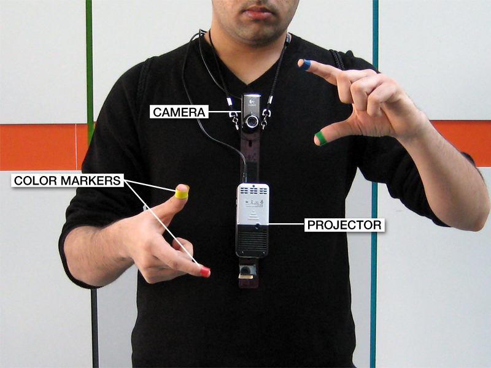

Wearable Devices
================

#
##
###### 雷雅琪
###### 刘玉松

***

# Iron Man

## He has a cool suit

***

# And he has a lot！

---

# He's not alone!

***

# Bat Man

---

### And More ...

***

# Not a big fan ?

### It's just a moive,
### They are all tall, handsome and rich,
### a lot of imaginary stuff,
### it's just for show！
### No such thing in real life!

***

## How about Google Glass

---

***

## It's not alone, neither!

---

---

---

---

## Compared with Google Glass,
## they still need some improvements.

***

# Not just glasses ...

---

### watch

---

### boots

---

### jeans

---

### shoes

---

### T-shirt

---

### phone

***

## Sixth Sense
### from MIT

---

### Pocket Projector  +  Mirror  +  Camera

---

### read newspaper

---

### kind of silly from this side

---

# A world full of magic ahead ...